# Diffusion Model Interface

## Table of Contents
- [Introduction](#introduction)
- [Features](#features)
- [Installation](#installation)
- [Usage](#usage)
- [Model Training](#model-training)
- [Observations](#observations)
- [Acknowledgments](#acknowledgments)
- [License](#license)

---


## Introduction
This project is a **custom-trained Latent Diffusion Model (LDM)** designed for **text-to-image generation, image transformation (Img2Img), inpainting, and real-time denoising**. The core of this repository is the **entire pipeline**, from **training a latent diffusion model from scratch** to providing an **interactive web-based interface** for users to generate and manipulate images.

At its foundation, this project follows the **Denoising Diffusion Probabilistic Models (DDPM)** and **Denoising Diffusion Implicit Models (DDIM)** framework, utilizing **classifier-free guidance** and **VAE-encoded latent space** for more efficient training and inference. The model was trained on a **synthetic dataset generated using Stable Diffusion**, totaling **~100k augmented samples** across **four major categories**: **Humans, Animals, Mythical Beings, and Scenery**. 

### **Key Highlights**
- **Custom-Trained Diffusion Model**: Created and trained from scratch using a **100k-image dataset** with a hybrid **MSE + Perceptual Loss** function.
- **Latent Diffusion for Efficiency**: Leverages a **Variational Autoencoder (VAE)** to compress image data into a **lower-dimensional latent space**, significantly improving training speed and memory efficiency.
- **Multi-Stage Training Process**: The model was trained over **320 GPU hours**, incorporating **UNet-based noise prediction, CLIP text conditioning, and randomized timestep sampling**.
- **Image Generation**: Enables **text-to-image generation** with **configurable guidance scales**, **sampling methods (DDPM, DDIM)**, and **denoising step adjustments**.
- **Interactive Web UI**: Built using **Flask**, featuring **real-time progress tracking, img2img, inpainting, semi-real-time denoising visualization among many others**.

<p align="center">
  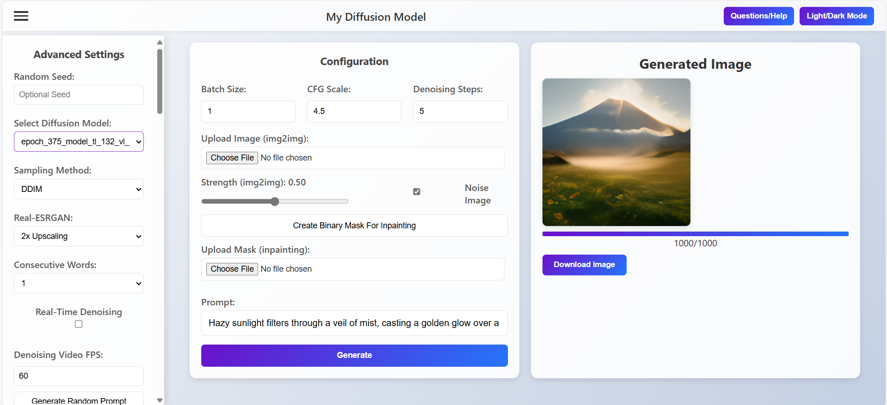
</p>

This project serves as a **practical implementation of diffusion models** for research and educational purposes. 


---


## Features

### **Core Diffusion Capabilities**
- 🖼️ **Text-to-Image Generation** – Generate images from text prompts using a **custom-trained Latent Diffusion Model (LDM)**.
- 🎨 **Img2Img (Image Transformation)** – Modify existing images by applying diffusion-based transformations
- 🛠️ **Inpainting** – Fill in missing or removed portions of an image using AI-generated content.

### **Advanced Customization**
- ⚙️ **Configurable Parameters** – Fine-tune generation with:
  - **Batch Size** (Generate multiple images simultaneously)
  - **Classifier-Free Guidance (CFG) Scale** (Control prompt adherence)
  - **Denoising Steps** (Adjust diffusion refinement level)
  - **Sampling Method** – Choose between **DDPM (stochastic)** and **DDIM (deterministic)** for different generation styles.
  
### **User Experience Enhancements**
- 📥 **Image Downloading** – Easily save generated images locally.
- 🖼️ **Image Upscaling** – Optional **2x and 4x** upscaling with **Real-ESRGAN** for higher resolution outputs.
- 🔄 **Random Prompt Generation** – Automatically generate structured prompts based on pre-defined or user-selected categories.
- 🎭 **Mask Creation for Inpainting** – Allow users to create a binary mask for a given image.

### **Interactive Real-Time Enhancements**
- 🔄 **Real-Time Denoising** – Observe the image denoising process frame-by-frame by saving intermediate diffusion steps.
- 📊 **Live Progress Tracking** – A dynamically updating progress bar visualizes the generation process in real time.


### **Real-Time Denoising Feature**
📌 **Example: Prompt –**  
*A majestic phoenix engulfed in burning flames, its radiant feathers glowing with fiery brilliance.*

<p align="center">
  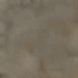
</p>

---


## Installation

### Steps
1. **Clone the repository**
   ```sh
   git clone https://github.com/IvanC987/DiffusionGen
   ```

2. Due to GitHub restrictions, I have separated the Diffusion model weights and stored it in my HuggingFace Repo, which can be accessed at:
`https://huggingface.co/DL-Hobbyist/DiffusionGen/tree/main/inference/diffusion_model_weights`
Since each file is ~4.7GB, I would recommend choosing the 'best' version, epoch 375.
Download whichever ones you would like to play around with and place them within the following directory

   ```sh
   DiffusionGen\inference\diffusion_model_weights
   ```
   
3. Install all the required pip packages in requirements.txt using

   ```sh
    pip install -r requirements.txt
   ```

4. CD into `DiffusionGen` and run `python3 inference/app.py`


The web interface should now be available at http://127.0.0.1:5000/

Have Fun!


### Important Notes- 

1. **HuggingFace Authentication**
   You may need to authenticate and log into your HuggingFace account to access certain models. Use the following command:
   ```python
   from huggingface_hub import login
   ```
   This is necessary because the OpenAI CLIP model and Stable Diffusion's VAE are pulled from HuggingFace.

<br>

2. **Fixing `ModuleNotFoundError`**
   If you encounter the error:
   ```sh
   ModuleNotFoundError: No module named 'torchvision.transforms.functional_tensor'
   ```
   This is due to the deprecation of the `functional_tensor` module. To resolve this:
   - Navigate to the file:
     ```sh
     basicsr\data\degradations.py
     ```
   - Update the import statement from:
     ```python
     from torchvision.transforms.functional_tensor import rgb_to_grayscale
     ```
     to:
     ```python
     from torchvision.transforms.functional import rgb_to_grayscale
     ```

3. It is recommended to use a **virtual environment** (or docker container) to avoid dependency conflicts and possible environment pollution.  
   
---


## Usage

### Running the Interface
1. Enter a **text prompt** to generate an image. (Due to the way the model was trained, the prompts should follow a specific 'style'. Take a look at the provided prompts in the GUI along with 'Prompt Gen Tips' button at the top of the GUI)
2. Adjust various parameters such as **CFG scale**, **Denoising Steps**, and **Batch Size** as needed.
3. Click **Generate** to create an image.

### Using Img2Img
- Upload an image and set the **strength** (higher values introduce more changes).
- Click **Generate** to transform the image.

### Real-Time Denoising
- Check the **Real-Time Denoising** box.
- The intermediate steps of the denoising process will be saved within the `inference\flask_outputs\denoising_temp` folder as individual images, where it would automatically compiled into a video of chosen frame rate.

### Inpainting
- Upload an image and a binary mask to specify areas to fill.
- Click **Generate** for inpainting.

### Configuration
- **Batch Size:** Number of images to generate at once.
- **CFG Scale:** Classifier-Free Guidance Scale (higher = more influence from prompt).
- **Denoising Steps:** Number of steps in the reverse diffusion process.
- **Strength (Img2Img):** Determines how much of the original image is preserved.
- **Sampling Method:** Choose between `DDPM` (stochastic) and `DDIM` (deterministic).


### Additional Feature
Users can:
- Choose to generate random prompts, which can be chosen from the training data or unseen data by the model (through the `Use Training Prompts` checkbox)
- Select/Deselect certain categories for random prompt generation
- Select different variations of downloaded diffusion models
- Fix random seed (Make DDIM completely deterministic)
- Create custom binary mask for inpainting
- Choose whether or not to use the `Real-Time Denoising` feature and specify the frame rate of the final compiled video (60 fps by default)
- And others.


### Notes:
- This is a fairly small Latent Diffusion Model (~370M Parameters), hence it would be able to run fairly well even on a CPU (Though limited to DDIM. GPU is recommended for DDPM)
- Regarding RealTime-Denoise: I originally intended for it to be actually real time in the GUI, but couldn't quite get the front end HTML/JS to work properly. Had to settle by saving the intermediate images to a temp folder and create a video out of it. So...'semi' RealTime-Denoise
- If using RealTime-Denoise, would recommend using the full DDPM with 1000 steps or DDIM with sufficient steps. As the final compiled video's length is directly dependent upon the specified frame rate and # of denoising steps
- There are certain limitations of this model, which is detailed in the [Observations](#observations) section below


---


## Model Training

This will be a very comprehensive explanation of how the model is trained. 
I've split it into multiple sections, namely

1. Dataset procurement/composition
2. Model architecture
3. Training process
4. Results


### **1. Dataset Procurement and Composition**  

When starting this project, one of the first and most crucial considerations was the dataset.  
Several key questions arose:  

- **What type of dataset should I use?**  
- **Where can I source it from?**  
- **How large should the dataset be?** (e.g., number of text-image pairs)  
- **How do I ensure high quality?** (A top priority)  
- **What resolution should the images have?** (For this project, all images are fixed at a 1:1 aspect ratio)  
- **What style should the images follow?** (Realism, Abstract, Concept Art, Anime, etc.)  
- **What other factors should be considered?**  

Among others, as dataset is a determining factor of the final model. 
As people say, 'Garbage in, garbage out', no?


I was looking through various dataset that HuggingFace offers, and although there are a lot of them, I couldn't quite decide on a particular dataset. 
Mainly due to the following constraints: 

1️⃣ **Limited Computational Resources**  
   - To train a model of this caliber, I believed **at least ~10k images** would be necessary.  
   - However, a dataset **around 1 million images or more** would be computationally infeasible (for me as a personal project). Hence, upper limit would be around a few hundred thousand or so images. 

2️⃣ **Quality Concerns**  
   - The dataset shouldn't be a **mix-and-match** of various resolutions.  
   - While resizing images using **PIL** is an option, there is the problem of quality degradation (Downsampling is generally fine, but upsampling would be a problem).  
   - Extremely low-res images would be detrimental to model performance given the limited number of training samples.  

3️⃣ **Style Consistency**  
   - Datasets vary widely in style—**realism, concept art, anime, cartoons, etc.**  
   - A dataset with **mixed styles could confuse the model** during training.  
   - Large-scale models can learn multiple styles effectively, like SD, but model of this size would have to focus on a single, or a few, style(s).

4️⃣ **Diversity vs. Consistency**  
   - The dataset should be **diverse enough** to allow generalization.  
   - However, it should still contain **sufficient samples per category** (e.g., humans, animals, scenery) to ensure balanced learning.  

In the end, I realized it wasn't very feasible to find my "ideal" dataset. 
So the alternative? Stable Diffusion. 

### **Generating a Synthetic Dataset with Stable Diffusion**
Fortunately, Stable Diffusion is open-source, allowing me to generate a custom dataset.  

Instead of using an existing dataset, I decided to:  
✅ **Rent a GPU** and use `stabilityai/stable-diffusion-3.5-large` from Hugging Face to generate images.  
✅ Control dataset **composition**, including **categories, resolution, and number of images**.  
✅ **Select a single style** to maintain consistency during training.


### **Final Dataset Composition**
After careful consideration, I structured my dataset as follows:

| **Category**        | **Approx. Image Count** | **Subcategories** |
|---------------------|----------------------|------------------|
| **Humans**         | **10k**               | Man, Woman, Boy, Girl, Teen, Guy, Kid |
| **Animals**        | **5k**                | Dog, Cat, Fish, Bird, Horse, Tiger, Wolf, Panda, Rhino, Whale |
| **Mythical Beings**| **5k**                | Qilin, Leviathan, Dragon, Fairy, Phoenix, Mermaid |
| **Scenery**        | **5k**                | Desert, Rainforest, Mountain Lake, Snowy Mountain, Tropical Island, Deep Sea, Night Sky, Glacier, Volcano, Aurora Borealis, Underwater Cave, Savannah |

**Total:** ~23.5k images (not exactly 25k due to variations in generation).  

The **human category contains twice as many images** as the others because:  
- Human generation is likely more common in real-world applications.  
- Generating human figures is hard to get correct

And through testing, it seems that the latter is correct (Though the former depends on the user)
Will touch more on this later on in the Observation section below. 
There's still a lot of more details that was omitted for the sake of conciseness. 


## **2. Model Architecture**

After spending several weeks on researching Diffusion Models and how they work, I decided to implement my own variation based on my knowledge. Needless to say it's not on par with production-level models, simply copying and pasting an existing implementation would have defeated the purpose of this project.  

> **Note:** The core of a **Diffusion Model** is the **U-Net**. The following explanation may be somewhat technical, and covering all details extensively would take too long.  

---

### **U-Net Implementation**
I designed my **U-Net** with the following components:  

#### **Time Encoder**
- Encodes the **chosen timestep** for diffusion.  
- Since this is similar to **positional encoding** in *"Attention Is All You Need"*, I opted to use a **modified version** of that approach.  

#### **Encoder Block**
- [Provide description here if needed]  

#### **Bottleneck**
- [Provide description here if needed]  

#### **Decoder Block**
- [Provide description here if needed]  


At the very end there's a sequential layer made of GroupNorm, SiLU, and Conv2D that returns the image (latent) tensor back into the original input tensor shape


Hyperparameters used here is fairly common, won't go into that. 
Located in `config.py`


I've also integrated 4 pretrained models, mentioned above, into the overarching pipeline 


---

### **📌 1. VAE (Variational Autoencoder)**
- The VAE is responsible for creating the latent representation of images, giving the "Latent" in Latent Diffusion Model.
- This significantly reduces training time by encoding images into a lower-dimensional space.
- The Stable Diffusion VAE downsamples image dimensions by 8x in both width and height.

---

### **📌 2. CLIP (Contrastive Language-Image Pretraining)**
- OpenAI's CLIP model is used to convert text prompts into numerical embeddings for conditioning.
- The output representation is of shape, (# of prompts, 77, 512)
  - 77: Fixed sequence length (capped at 77 tokens, and it's usually padded at 77 tokens if prompt is short).
  - 512: Dimensionality of each token embedding (used in Self/Cross attention).
- Prompt Length Limitation:
  - If a prompt exceeds 77 tokens (~55 words), it would usually be truncated or produce an error.
  - One might notice that behavior when using SD, though additional models like T5 are added to extend the sequence length


### **📌 2. VGG16 (Contrastive Language-Image Pretraining)**
- OpenAI's CLIP model is used to convert text prompts into numerical embeddings for conditioning.
- The output representation is of shape, (# of prompts, 77, 512)
  - 77: Fixed sequence length (capped at 77 tokens, and it's usually padded at 77 tokens if prompt is short).
  - 512: Dimensionality of each token embedding (used in Self/Cross attention).
- Prompt Length Limitation:
  - If a prompt exceeds 77 tokens (~55 words), it would usually be truncated or produce an error.
  - One might notice that behavior when using SD, though additional models like T5 are added to extend the sequence length


## **📌 3. VGG16 for Perceptual Loss**
The **VGG16 model**, developed by the **Visual Geometry Group (VGG) at Oxford**, is incorporated into the training process as part of the **loss function**.

### **🔹 Why Use VGG16?**
- It is used for **perceptual loss**, which **compares high-level features of images** rather than just pixel differences.
- This helps the model **retain better structure and texture** in generated images.
- Through testing, **perceptual loss added a smoothing effect**, reducing artifacts but also potentially leading to **over-smoothing** if weighted too heavily.

---

## **🔹 Loss Function Comparisons**
To assess the impact of perceptual loss, I trained the model for **30 epochs on the same dataset** while keeping all other factors constant.

Below are **comparisons of different loss function weights**, showing how perceptual loss influences image generation.

### **1️⃣ MSE Loss Only**

<p align="center">
  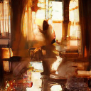
  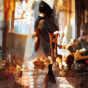
  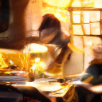
</p>

---

### **2️⃣ MSE + 0.33 × Perceptual Loss**

<p align="center">
  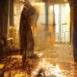
  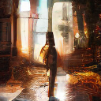
  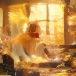
</p>

---

### **3️⃣ MSE + 1 × Perceptual Loss**

<p align="center">
  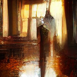
  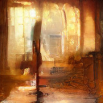
  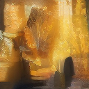
</p>

---

### **4️⃣ MSE + 3 × Perceptual Loss**

<p align="center">
  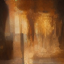
  
  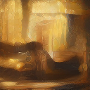
</p>

---

### **5️⃣ Perceptual Loss Only**

<p align="center">
  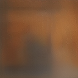
  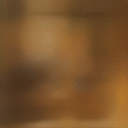
  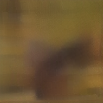
</p>

---

In the end, I settled with a balance between the two using:

```sh
final_loss = MSE + 0.25 * perceptual_loss
```


### **📌 4. Real-ESRGAN for Image Upscaling**
- Upscales and refines images for higher-resolution outputs.
- Provides 2x and 4x upscaling options.
- Helps improve image clarity and detail (better than traditional methods like nearest neighbor, bilinear, and bicubic).

---

Do note that although it upscale and refine the image, it is **NOT** the same as training/generating model of those resolution. 
Also, **Real-ESRGAN** is not used during training but is integrated into inference to enhance and upscale generated images.


## **3. Training Process**

The training hyperparameters are located in `config.py`.

Before starting the official training, I artificially increased the dataset via data augmentation, primarily using **horizontal flip** and **color adjustments**. The final dataset was **4x the original size**, composed of:

1. **Original Image**
2. **Original Image + Color Adjustment**
3. **Horizontal Flip**
4. **Horizontal Flip + Color Adjustment**

The corresponding prompt was copied **3 times**. The two primary benefits of this approach are:

1. **Dataset Size Increase**: The dataset size increased from ~23.5k images to ~94k images. Since the loss function is primarily based on **MSE (Mean Squared Error)**, this greatly aided the training process.
2. **1-to-4 Relationship Between Text and Images**: Each text prompt now corresponds to **4 images**. For example, if the prompt is *"A dog running across a bright green lawn"*, there would be 4 images associated with it. This helps the model generalize better, as all four images are valid representations of the prompt.  
   **Note**: Horizontal flip can only be used for images that are not directionally dependent (e.g., images containing text).

---

### **Training Details**

During the training process, the model processes a batch of randomly chosen images, which are encoded using **Stable Diffusion's VAE (Variational Autoencoder)**. The tensor dimensions are as follows:

- **Input Tensor Shape**: `(batch, channel, height, width)`  
  Example: `(128, 3, 1024, 1024)`  
- **Output Tensor Shape**: `(128, 4, 128, 128)`  

---

### **Example**

Since the VAE encodes an image from **3 channels (RGB)** to **4 latent channels**, it’s challenging to represent the latent channels as RGB. However, the following example provides a visual representation of the process:

📌 **Original 1024x1024 Image**:

<p align="center">  
  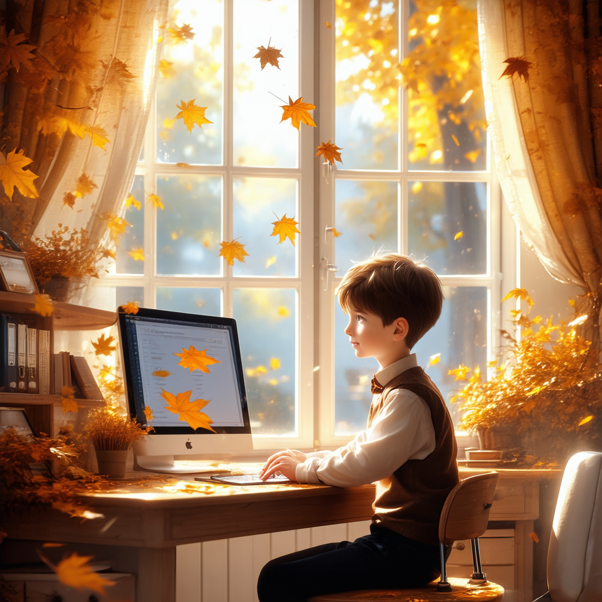  
</p>  

📌 **VAE Encoded 128x128 Representation**:

<p align="center">  
  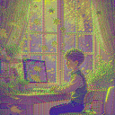  
</p>  


### 4. Results

During the training, I have stored the outputs below:

#### Loss Files:
- **`epoch_loss.txt`**: Details the epoch number, training loss, mse_loss, perceptual loss, validation loss, learning rate, and time taken (in seconds).
- **`final_custom_losses.txt`**: Stores space-separated loss values for training loss, mse_loss, and perceptual loss per training step.
- **`final_custom_val_losses.txt`**: Stores the validation loss per training step.

> **Note**: For `mse_loss` and `perceptual_loss`, I've accidentally scaled them by 4x. However, all other losses are correct.

---

#### Training Details:
After training the model for about **320 GPU hours** on a single A40 (~14 days), here are the results:

<p align="center">
  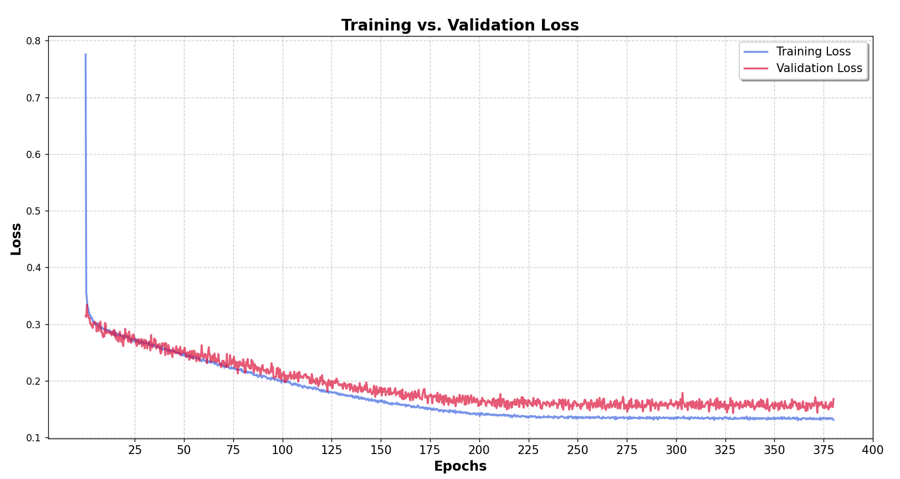
</p>


- The training progress was surprisingly stable.
- Like most models, the first few epochs drastically reduce the loss.
- For the next ~200 epochs, the loss stabilizes and decreases linearly, which is surprising.
- At around epoch 50, the loss starts to diverge, but they are still proportionally decreasing.
- After the ~200 epoch mark, the loss starts to plateau, which is expected. Although it's hard to tell, both losses are slightly decreasing for the next ~180 epochs.
- Due to time and computational limitations, I had to stop training and cut it off at epoch 380. The most recent version, epoch 375, is currently the best in terms of both losses.
- This graph was plotted using the two final loss files, where I averaged every 19 steps losses into a single value (since the ratio of training to validation was approximately 19:1).
- To reduce fluctuations, I further averaged 25 values into a single scalar.
- The graph does seem to be right-shifted by a slight margin (not sure why).


## Observations

When testing out the final model, I noticed the following:

---

### 1. Output Quality Varies Across Categories

When users enter a prompt in the **'Scenery'** category, usually the generated image would look decently better than those of other categories (**Humans**, **Animals**, and **Mythical Beings**).
I attributed this to our internal bias and model objective.  
Whether or not an image looks "good" is inherently subjective to us. If a given prompt is something like *"A horse galloping across a grassland..."*, then we would expect to see an image where the main subject is a horse galloping, and grassland as background.  
However, if an image is generated, one would notice that the **'horse'** would be somewhat blurry/lower quality, relative to the background.  
Recall that the training objective of the model is the **MSE loss**. The way that the loss is calculated would make the model weight all the pixels equally. The **"subject"** would take up less area of the image compared to the background.  
Hence, generally, the background—when relatively uniform—would look better compared to the main subject.  
This is especially the case when comparing text prompts of small subjects like **cat** vs larger subjects like **rhino**. The former is noticeably more blurred compared to the latter.  
This is the primary reason why I made the **'Humans'** category of the dataset double the size of other categories.  
Although people take up a fair chunk of the total pixels, the majority of the time it is around **~20%**. The rest is all common background.  
Assuming **20%**, we ourselves would be especially biased towards certain parts of the generated person in question. For example, it is commonly the case that we would scrutinize the facial feature of the person in the image compared to other body parts (like arms, legs, body, etc.).  
And the final result proved that this was indeed the case.  
The model would weight the facial feature of the humans equally with all other pixels, like background and such, and so it would be especially 'blurred' in a way.  

---

### 2. Diversity of Output Images

In general, when generating images via models like **Stable Diffusion**, the output would be quite diverse given the same prompt.  
This is due to how the initial image is created and the process of image generation.  
However, this model's output is relatively fixed. When giving the model the same prompt, the output would be vary slightly but overall stay highly similar.  
I suspect this is due to the dataset, rather than the model architecture/training itself.  
Assume the dataset has **25k images** for simplicity:  
- **10k** is **Humans**  
- **5k** for each of the remaining categories (**Animals**, **Mythical Beings**, **Scenery**)  

Take a look at, for example, **Scenery**.  
There are **12 subcategories**:  
- Desert  
- Rainforest  
- Mountain Lake  
- Snowy Mountain  
- Tropical Island  
- Deep Sea  
- Night Sky  
- Glacier  
- Volcano  
- Aurora Borealis  
- Underwater Cave  
- Savannah  

The prompts are selected at random through uniform distribution, and so it's fair to assume that in the entire dataset, there would be approximately **420 images per subcategory**.  
This is extremely low—nearly the bare minimum needed to even train a diffusion model, I would say.  
(There's also the problem of diversity of descriptive adjectives in textual prompts which I won't go into)  
Anyways, **420 images per category**. That is very low.  
And so, you can imagine how limited the diversity of the dataset is.  
**Stable Diffusion** is trained on the **LAION dataset**, in the magnitude of **billions of images**, whereas this uses **100k (with augmentation)**. So it's nowhere near comparable, in terms of dataset size.  


**TLDR:** Limited dataset → Limited Output  

---

### 3. Img2Img  

This feature is very interesting; however, due to the problem mentioned above, the output is often blurry and of low quality.  
Unfortunately, that can't be helped. This stems from the training dataset, rather than from implementation, so ¯\_(ツ)_/¯.  

---

### 4. Inpainting  

Likewise, this is also somewhat forced. Viewed in real-time denoising, it's fairly intriguing, but outputs are quite...bad.  
Welp.  


---

And this concludes the end of this project. 
I tried to strike a balance between keeping it detailed but not overly long, so I had to cut out some additional parts. 
Anyways, this was a very interesting project and would likely revisit it later in the future with various improvements, particularly with a focus on the dataset. 

---


## Acknowledgments
This project utilizes:
- [Variational Autoencoder (VAE)](https://huggingface.co/stabilityai/sd-vae-ft-ema) from Stable Diffusion for encoding and decoding images in the latent space.
- [CLIP (Contrastive Language-Image Pretraining)](https://huggingface.co/openai/clip-vit-base-patch32) from OpenAI for text-to-image embedding.
- [Real-ESRGAN](https://github.com/xinntao/Real-ESRGAN) for upscaling.
- [Perceptual Loss (LPIPS)](https://github.com/richzhang/PerceptualSimilarity) for evaluating image similarity.


This project is inspired by and builds upon the foundational research from the following papers:

- **High-Resolution Image Synthesis with Latent Diffusion Models**  
  *Rombach et al.*  
  [🔗 arXiv:2112.10752](https://arxiv.org/abs/2112.10752)

- **Denoising Diffusion Probabilistic Models**  
  *Ho, Jain, Abbeel*  
  [🔗 arXiv:2006.11239](https://arxiv.org/abs/2006.11239)

- **Denoising Diffusion Implicit Models**  
  *Song, Meng, Ermon*  
  [🔗 arXiv:2010.02502](https://arxiv.org/abs/2010.02502)


Finally, huge thanks to Umar Jamil with his [Stable Diffusion Video](https://www.youtube.com/watch?v=ZBKpAp_6TGI&t=9117s) and ExplainAI's [Stable Diffusion Video](https://www.youtube.com/watch?v=hEJjg7VUA8g&list=PL8VDJoEXIjpo2S7X-1YKZnbHyLGyESDCe)


## License
This project is licensed under the **MIT License**.


