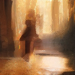

# Diffusion Model Interface
# INCLUDE GIF IN README FOR DENOISING!
## Table of Contents
- [Introduction](#introduction)
- [Features](#features)
- [Installation](#installation)
- [Usage](#usage)
- [Model Training](#model-training)
- [Observations](#observations)
- [Acknowledgments](#acknowledgments)
- [License](#license)

---


## Introduction
This project is a **custom-trained Latent Diffusion Model (LDM)** designed for **text-to-image generation, image transformation (Img2Img), inpainting, and real-time denoising**. The core of this repository is the **entire pipeline**, from **training a latent diffusion model from scratch** to providing an **interactive web-based interface** for users to generate and manipulate images.

At its foundation, this project follows the **Denoising Diffusion Probabilistic Models (DDPM)** and **Denoising Diffusion Implicit Models (DDIM)** framework, utilizing **classifier-free guidance** and **VAE-encoded latent space** for more efficient training and inference. The model was trained on a **synthetic dataset generated using Stable Diffusion**, totaling **~100k augmented samples** across **four major categories**: **Humans, Animals, Mythical Beings, and Scenery**. 

### **Key Highlights**
- **Custom-Trained Diffusion Model**: Created and trained from scratch using a **100k-image dataset** with a hybrid **MSE + Perceptual Loss** function.
- **Latent Diffusion for Efficiency**: Leverages a **Variational Autoencoder (VAE)** to compress image data into a **lower-dimensional latent space**, significantly improving training speed and memory efficiency.
- **Multi-Stage Training Process**: The model was trained over **320 GPU hours**, incorporating **UNet-based noise prediction, CLIP text conditioning, and randomized timestep sampling**.
- **Image Generation**: Enables **text-to-image generation** with **configurable guidance scales**, **sampling methods (DDPM, DDIM)**, and **denoising step adjustments**.
- **Interactive Web UI**: Built using **Flask**, featuring **real-time progress tracking, img2img, inpainting, semi-real-time denoising visualization among many others**.

<p align="center">
  
</p>

This project serves as a **practical implementation of diffusion models** for research and educational purposes. 


---


## Features

### **Core Diffusion Capabilities**
- 🖼️ **Text-to-Image Generation** – Generate images from text prompts using a **custom-trained Latent Diffusion Model (LDM)**.
- 🎨 **Img2Img (Image Transformation)** – Modify existing images by applying diffusion-based transformations
- 🛠️ **Inpainting** – Fill in missing or removed portions of an image using AI-generated content.

### **Advanced Customization**
- ⚙️ **Configurable Parameters** – Fine-tune generation with:
  - **Batch Size** (Generate multiple images simultaneously)
  - **Classifier-Free Guidance (CFG) Scale** (Control prompt adherence)
  - **Denoising Steps** (Adjust diffusion refinement level)
  - **Sampling Method** – Choose between **DDPM (stochastic)** and **DDIM (deterministic)** for different generation styles.
  
### **User Experience Enhancements**
- 📥 **Image Downloading** – Easily save generated images locally.
- 🖼️ **Image Upscaling** – Optional **2x and 4x** upscaling with **Real-ESRGAN** for higher resolution outputs.
- 🔄 **Random Prompt Generation** – Automatically generate structured prompts based on pre-defined or user-selected categories.
- 🎭 **Mask Creation for Inpainting** – Allow users to create a binary mask for a given image.

### **Interactive Real-Time Enhancements**
- 🔄 **Real-Time Denoising** – Observe the image denoising process frame-by-frame by saving intermediate diffusion steps.
- 📊 **Live Progress Tracking** – A dynamically updating progress bar visualizes the generation process in real time.


### **Real-Time Denoising Feature**
📌 **Example: Prompt –**  
*A majestic phoenix engulfed in burning flames, its radiant feathers glowing with fiery brilliance.*

<p align="center">
  
</p>

---


## Installation
### Prerequisites
Ensure you have the following installed:
- torch
- torchvision
- flask
- diffusers
- transformers
- realesrgan
- opencv-python
(Probably missing some. Will add it later on when found)

> **Note:** It is recommended to use a **virtual environment** to avoid dependency conflicts.  
                                   

### Steps
1. **Clone the repository**
   ```sh
   git clone https://github.com/IvanC987/DiffusionGen
   ```

2. Due to GitHub restrictions, I have separated the Diffusion model weights and stored it in my HuggingFace Repo, which can be accessed at:
`https://huggingface.co/DL-Hobbyist/DiffusionGen/tree/main/inference/diffusion_model_weights`
Since each file is ~4.7GB, I would recommend choosing the 'best' version, epoch 375.
Download whichever ones you would like to play around with and place them within the following directory

   ```sh
   `DiffusionGen\inference\diffusion_model_weights`
   ```
   
3. Install all the required packages in requirments.txt

4. CD into `DiffusionGen` and run `python3 inference/app.py`


The web interface should now be available at http://127.0.0.1:5000/

Have Fun!


### Important Notes- 

1. **HuggingFace Authentication**
   You may need to authenticate and log into your HuggingFace account to access certain models. Use the following command:
   ```python
   from huggingface_hub import login
   ```
   This is necessary because the OpenAI CLIP model and Stable Diffusion's VAE are pulled from HuggingFace.

<br>

2. **Fixing `ModuleNotFoundError`**
   If you encounter the error:
   ```sh
   ModuleNotFoundError: No module named 'torchvision.transforms.functional_tensor'
   ```
   This is due to the deprecation of the `functional_tensor` module. To resolve this:
   - Navigate to the file:
     ```sh
     basicsr\data\degradations.py
     ```
   - Update the import statement from:
     ```python
     from torchvision.transforms.functional_tensor import rgb_to_grayscale
     ```
     to:
     ```python
     from torchvision.transforms.functional import rgb_to_grayscale
     ```

---


## Usage

### Running the Interface
1. Enter a **text prompt** to generate an image. (Due to the way the model was trained, the prompts should follow a specific 'style'. Take a look at the provided prompts in the GUI along with 'Prompt Gen Tips' button at the top of the GUI)
2. Adjust various parameters such as **CFG scale**, **Denoising Steps**, and **Batch Size** as needed.
3. Click **Generate** to create an image.

### Using Img2Img
- Upload an image and set the **strength** (higher values introduce more changes).
- Click **Generate** to transform the image.

### Real-Time Denoising
- Check the **Real-Time Denoising** box.
- The intermediate steps of the denoising process will be saved within the `inference\flask_outputs\denoising_temp` folder as individual images, where it would automatically compiled into a video of chosen frame rate.

### Inpainting
- Upload an image and a binary mask to specify areas to fill.
- Click **Generate** for inpainting.

### Configuration
- **Batch Size:** Number of images to generate at once.
- **CFG Scale:** Classifier-Free Guidance Scale (higher = more influence from prompt).
- **Denoising Steps:** Number of steps in the reverse diffusion process.
- **Strength (Img2Img):** Determines how much of the original image is preserved.
- **Sampling Method:** Choose between `DDPM` (stochastic) and `DDIM` (deterministic).


### Additional Feature
Users can:
- Choose to generate random prompts, which can be chosen from the training data or unseen data by the model (through the `Use Training Prompts` checkbox)
- Select/Deselect certain categories for random prompt generation
- Select different variations of downloaded diffusion models
- Fix random seed (Make DDIM completely deterministic)
- Create custom binary mask for inpainting
- Choose whether or not to use the `Real-Time Denoising` feature and specify the frame rate of the final compiled video (60 fps by default)
- And others.


### Notes:
- This is a fairly small Latent Diffusion Model (~370M Parameters), hence it would be able to run fairly well even on a CPU (Though limited to DDIM. GPU is recommended for DDPM)
- Regarding RealTime-Denoise: I originally intended for it to be actually real time in the GUI, but couldn't quite get the front end HTML/JS to work properly. Had to settle by saving the intermediate images to a temp folder and create a video out of it. So...'semi' RealTime-Denoise
- If using RealTime-Denoise, would recommend using the full DDPM with 1000 steps or DDIM with sufficient steps. As the final compiled video's length is directly dependent upon the specified frame rate and # of denoising steps
- There are certain limitations of this model, which is detailed in the [Observations](#observations) section below


---


## Model Training

This will be a very comprehensive explanation of how the model is trained. 
I've split it into multiple sections, namely

1. Dataset procurement/composition
2. Model architecture
3. Training process
4. Results


### **1. Dataset Procurement and Composition**  

When starting this project, one of the first and most crucial considerations was the dataset.  
Several key questions arose:  

- **What type of dataset should I use?**  
- **Where can I source it from?**  
- **How large should the dataset be?** (e.g., number of text-image pairs)  
- **How do I ensure high quality?** (A top priority)  
- **What resolution should the images have?** (For this project, all images are fixed at a 1:1 aspect ratio)  
- **What style should the images follow?** (Realism, Abstract, Concept Art, Anime, etc.)  
- **What other factors should be considered?**  

Among others, as dataset is a determining factor of the final model. 
As people say, 'Garbage in, garbage out', no?


I was looking through various dataset that HuggingFace offers, and although there are a lot of them, I couldn't quite decide on a particular dataset. 
Mainly due to the following constraints: 

1️⃣ **Limited Computational Resources**  
   - To train a model of this caliber, I believed **at least ~10k images** would be necessary.  
   - However, a dataset **around 1 million images or more** would be computationally infeasible (for me as a personal project). Hence, upper limit would be around a few hundred thousand or so images. 

2️⃣ **Quality Concerns**  
   - The dataset shouldn't be a **mix-and-match** of various resolutions.  
   - While resizing images using **PIL** is an option, there is the problem of quality degradation (Downsampling is generally fine, but upsampling would be a problem).  
   - Extremely low-res images would be detrimental to model performance given the limited number of training samples.  

3️⃣ **Style Consistency**  
   - Datasets vary widely in style—**realism, concept art, anime, cartoons, etc.**  
   - A dataset with **mixed styles could confuse the model** during training.  
   - Large-scale models can learn multiple styles effectively, like SD, but model of this size would have to focus on a single, or a few, style(s).

4️⃣ **Diversity vs. Consistency**  
   - The dataset should be **diverse enough** to allow generalization.  
   - However, it should still contain **sufficient samples per category** (e.g., humans, animals, scenery) to ensure balanced learning.  

In the end, I realized it wasn't very feasible to find my "ideal" dataset. 
So the alternative? Stable Diffusion. 

### **Generating a Synthetic Dataset with Stable Diffusion**
Fortunately, **Stable Diffusion** is open-source, allowing me to **generate a custom dataset**.  

Instead of using an existing dataset, I decided to:  
✅ **Rent a GPU** and use `stabilityai/stable-diffusion-3.5-large` from Hugging Face to generate images.  
✅ Control dataset **composition**, including **categories, resolution, and number of images**.  
✅ **Select a single style** to maintain consistency during training.


### **Final Dataset Composition**
After careful consideration, I structured my dataset as follows:

| **Category**        | **Approx. Image Count** | **Subcategories** |
|---------------------|----------------------|------------------|
| **Humans**         | **10k**               | Man, Woman, Boy, Girl, Teen, Guy, Kid |
| **Animals**        | **5k**                | Dog, Cat, Fish, Bird, Horse, Tiger, Wolf, Panda, Rhino, Whale |
| **Mythical Beings**| **5k**                | Qilin, Leviathan, Dragon, Fairy, Phoenix, Mermaid |
| **Scenery**        | **5k**                | Desert, Rainforest, Mountain Lake, Snowy Mountain, Tropical Island, Deep Sea, Night Sky, Glacier, Volcano, Aurora Borealis, Underwater Cave, Savannah |

**Total:** ~23.5k images (not exactly 25k due to variations in generation).  

The **human category contains twice as many images** as the others because:  
- **Human generation is likely more common** in real-world applications.  
- **Generating human figures is


Anyways, the ratio of Humans compared to other three is twice the amount. 
That's because I was thinking,
1. Generation of human figures might be more common compared to other categories
2. Human figures are hard to get correct

And through testing, it seems that the latter is correct (Though the former depends on the user)
Will touch more on this later on. 
There's still a lot of more details that was omitted for the sake of conciseness. 
Next is model architecture. 


2. Model Architecture
After going through multiple sources and a few weeks of research of Diffusion Models and how they work, I decided to implement a variation of my own (Which is definitely worse than production levels, but just copying and pasting defeats the purpose of this project)

(Note that the core of the Diffusion Model is the UNet and that the following explaination may be techical. It would take too long to explain eveyrthing in detail)

I gathered everything together and built the UNet with the following blocks: 
TimeEncoder- This class returns the encoding of the chosen timestep. Since it's quite similar to the positional encoding used in `Attention Is All You Need`, I just decided to use that 
EncoderBlock- This contains 
BottleNeck- 
DecoderBlock-

At the very end there's a sequential layer made of GroupNorm, SiLU, and Conv2D that returns the image (latent) tensor back into the original input tensor shape


Hyperparameters used here is fairly common, won't go into that. 
Located in `config.py`


I've also integrated 4 pretrained models, mentioned above, into the overarching pipeline 

- VAE
The Variational Autoencoder is what creates the latent representation of images, hence the 'Latent' in Latent Diffusion Model
This allows the training time to be drastically reduced, in this case using SD's VAE, it downsamples the dimensions by 8x of goth width and height

- CLIP
OpenAI's Contrastive Language Image Pretraining model. 
I won't go into details as that would take quite long, but it's the model that converts textual prompts into numerical representation of shape (# of prompts, 77, 512)
Note that the 2nd and 3rd dimensions are fixed. 
2nd dimension is the sequence length, where it's capped at 77 tokens, and padded if less than 77 tokens. 
Often one would find SD give an error if one's prompt is too long (or warning with truncation), that's because SD also uses CLIP and it's capped at 77 tokens (~55 or so words)
Though they have also added models like T5 to increase the limit
3rd dimension is the embedding dimensionality of each token, primarily used in the attention mechanism

- VGG16
This model is used as part of the training loss objective as perceptual loss. Through testing, it kind of adds a "smoothing factor" to the resulting images. 
I have added a link below in the acknowledgement section if interested in details. 
When testing, I used various ratio of MSE and Perceptual Loss, here are the comparisons:

Here are images using: 

loss = MSE


loss = MSE + 0.33 * perceptual


loss = MSE + perceptual


loss = MSE + 3 * perceptual




loss = perceptual


Doing what I can to keep a controlled environment, the model was trained for 30 epochs on the same dataset and same number of epochs.
However due to the stochastic nature of this, even though the same prompt was given, image subjects does somewhat differ. 
But overall, one can see that as the perceptual loss dominates the loss contribution, the images gets more and more "smoothed", until it is nearly a blur

In the end, I decided to pick 
loss = MSE + 0.25 * perceptual
as the final loss. 


- Real ESRGAN
Also linked a reference to it below
This model is not used during the training process, rather, used during inference
Its main purpose is to upscale a given image and further refine it
I have the 2x and 4x version. So the training dataset was based on 128x128 resolution images, when inferencing the model via `inference/app.py`, users have the option to choose using No Upsampling, 2x, and 4x the outputs. 
Corresponding to 128x128, 256x256, and 512x512 resolution images. 
Do note that although it upscale and refine the image, it is NOT the same as training/generating model of those resolution. Much better than direct upsample via methods like nearest neighbors, bilinear, and bicubic, but still have some limitations. 
Though overall it does work very well. 


3. Training Process
The training hyperparameters are also located in `config.py`

Before I started the official training, I artificially increased the dataset via data augmentation, primarily using horizontal flip and color adjustments. 
So the final dataset was 4x the original size, composed of.
1. Original Image
2. Original Image + Color Adjustment
3. Horizontal Flip
4. Horizontal Flip + Color Adjustment

The corresponding prompt was copied 3 times. The two primary benefits of this is that
1. Dataset is increased by 3x. Instead of ~23.5k images, it is now ~94k images. Considering the loss function is primarily based on MSE, this greatly helped the training
2. There is now a 1-to-4 relationship between the text prompt and the images. For example, if a prompt is "A dog running across a bright green lawn", then there would be 4 images that corresponds to that. This would help the model generalize better, since all four images are valid for that prompt. Note that horizontal flip can only be used where images are not directionally dependent (e.g. Images containing texts)


During the training process, the model would get a batch of randomly chosen images and encode via SD's VAE, where the tensor dimensions are (batch, channel, height, width)
For example, input tensor shape might be (128, 3, 1024, 1024)
output would then be (128, 4, 128, 128)

Here's an example (Since VAE encodes image from 3 channels, RGB, to 4 latent channels, it doesn't quite do it justice to try to represent the latent channels as RGB, but this just kind of "shows" what it does)


4. Results

During the training, I have stored the outputs below:


I have included the three loss files.
`epoch_loss.txt`- Details the epoch number, training loss, mse_loss, perceptual loss, validation loss, learning rate, and time taken (in seconds)
`final_custom_losses.txt`- Stores space separated loss values for training loss, mse_loss, perceptual loss per training step
`final_custom_val_losses.txt`- Stores the validation loss per training step

(For mse_loss and perceptual loss, I've accidentally scaled it by 4x. However all other losses are correct.)


After training the model for about 320 GPU hours on a single A40 (~14 days), here are the results: 


Plot of Training and Validation Loss:


Overall, the training progress was surprisingly stable. 
Like most models first few epochs drastically reduces the loss. 
Then for the next ~200 or so epochs it stabilizes and loss decreases linearly, which is surprising.
At around epoch 50, the loss starts to diverge, however they are still proportionally decreasing. 
After ~200 epoch mark, it starts to plateau, which is to be expected. Although it's hard to tell, however both losses are slighly decreasing for the next ~180 epochs.
However due to time and computational limitations, I had to stop training and cut it off at epoch 380, where the most recent version, epoch 375 is currently the best in both losses.


This graph was plotted using the two final loss files, where I averaged every 19 step's losses into a single value (since ratio of training to validation was approximately 19:1)
However the lines still fluctuate too much and so I further averaged 25 values into a single scalar. 

(The graph seemed to be right-shifted by a slight margin, not sure why)


## Observations

When testing out the final model, I noticed the following: 

1. Output quality varies across categories 
When users enter a prompt in the 'Scenery' category, usually the generated image would look decently better than those of other categories (Humans, Animals, and Mythical Beings)
I attributed this to our internal bias and model objective. 
Whether or not an image looks "good" is inherently subjective to us. If a given prompt is something like "A horse galloping across a grassland...", then we would expect to see an image where the main subject is a horse galloping, and grassland as background. 
However if an image is generated, one would notice that the 'horse' would be somewhat blurry/lower quality, relative to the background.
Recall that the training objective of the model is the MSE loss. The way that the loss is calculated would make the model weight all the pixels equally. The "subject" would take up less area of the image compared to the background. 
Hence generally the background, when relatively uniform, would look better compared to the main subject. 
This is esepcially the case when comparing text prompts of small subjects like cat vs larger subjects like rhino. The former is noticeably more blurred compared to the latter. 

This is the primary reason why the I made the 'Humans' category of the dataset double the size of other categories. 
Although people take up a fair chunk of the total pixels, majority of the time it is around ~20%. The rest is all common background. 
Assuming 20%, we ourselves would be especially biased towards certain parts of the generated person in question. For example, it is commonly the case that we would scrutinize the facial feature of the person in the image compared to other body parts (like arms, legs, body, etc.)
And the final result proved that this was indeed the case. 
The model would weight the facial feature of the humans equally with all other pixels, like background and such, and so it would be especially blurred. 
...


2. Diversity of output images
In general, when generating images via models like Stable diffusion, the output would be quite diverse given the same prompt. 
This is due to how the initial image is created and process of image generation. 
However this model's output is relatively fixed. When giving the model the same prompt, the output would very different, but highly similar. 

I suspect this is due to the dataset, rather than model architecture/training itself. 
Assume the dataset has 25k images for simplicity. 
10k is Humans
5k for each of the remaining categories (Animals, Mythical Beings, Scenery)

Take a look at for example, scenery. 
There are 12 subcategories, (Desert, Rainforest, Mountain Lake, Snowy Mountain, Tropical Island, Deep Sea, Night Sky, Glacier, Volcano, Aurora Borealis, Underwater Cave, Savannah),

The prompts are selected at random through uniform distribution, and so it's fair to assume that in the entire dataset would have
approximately 420 images per subcategory. This is extremely low, nearly the bare minimum needed to even train a diffusion model I would say.
(There's also the problem of diversity of descriptive adjectives in textual prompts, but that will take a while to explain)

Anyways, 420 image per category. That is very low. 
And so you can imagine how limited the diversity of the dataset is. 
Stable Diffusion is trained on the LAION dataset, in the magnitude of billions of images, whereas this uses 100k (with augmentation). So it's nowhere near comparable, in terms of dataset size. 

TLDR: Limited dataset -> Limited Output


3. Img2Img
This feature is very interesting, however due to the problem mentioned above, the output is often blurry and of low quality. 
Unfortunately that can't be helped. This stems from the training dataset, rather than from implementation, so...yeah


4. Inpaininting
Likewise, this is also somewhat forced. Viewed in real-time denoising it's fairly intriguing, but outputs are quite....bad. 
Welp. 


Think there's a few more. Will add those later on. 


And so this concludes the informal version of readme. The final version should be completed in another day or two. 


## Acknowledgments
This project utilizes:
- [Variational Autoencoder (VAE)](https://huggingface.co/stabilityai/sd-vae-ft-ema) from Stable Diffusion for encoding and decoding images in the latent space.
- [CLIP (Contrastive Language-Image Pretraining)](https://huggingface.co/openai/clip-vit-base-patch32) from OpenAI for text-to-image embedding.
- [Real-ESRGAN](https://github.com/xinntao/Real-ESRGAN) for upscaling.
- [Perceptual Loss (LPIPS)](https://github.com/richzhang/PerceptualSimilarity) for evaluating image similarity.


This project is inspired by and builds upon the foundational research from the following papers:

- **High-Resolution Image Synthesis with Latent Diffusion Models**  
  *Rombach et al.*  
  [🔗 arXiv:2112.10752](https://arxiv.org/abs/2112.10752)

- **Denoising Diffusion Probabilistic Models**  
  *Ho, Jain, Abbeel*  
  [🔗 arXiv:2006.11239](https://arxiv.org/abs/2006.11239)

- **Denoising Diffusion Implicit Models**  
  *Song, Meng, Ermon*  
  [🔗 arXiv:2010.02502](https://arxiv.org/abs/2010.02502)


Finally, huge thanks to Umar Jamil with his [Stable Diffusion Video](https://www.youtube.com/watch?v=ZBKpAp_6TGI&t=9117s) and ExplainAI's [Stable Diffusion Video](https://www.youtube.com/watch?v=hEJjg7VUA8g&list=PL8VDJoEXIjpo2S7X-1YKZnbHyLGyESDCe)


## License
This project is licensed under the **MIT License**.


